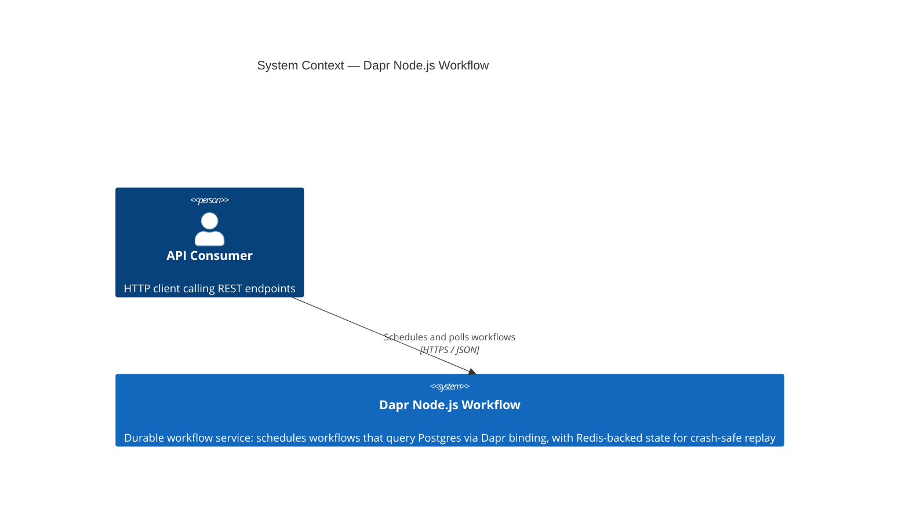
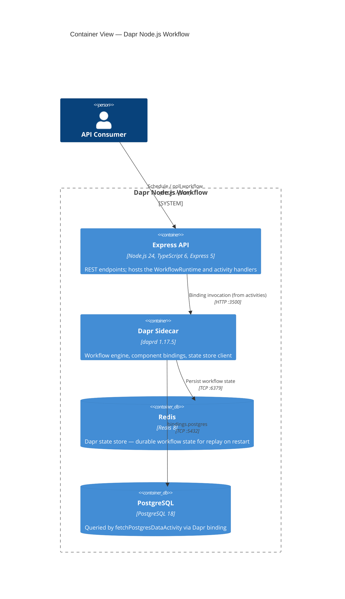
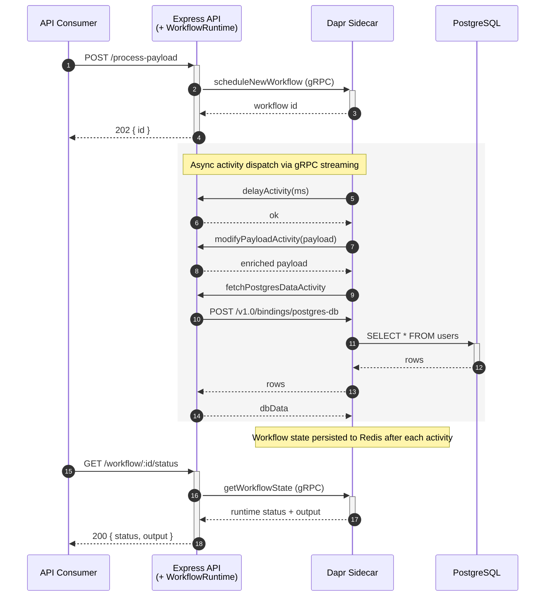

[](https://github.com/AndriyKalashnykov/dapr-nodejs-workflow/actions/workflows/ci.yml)
[](https://hits.sh/github.com/AndriyKalashnykov/dapr-nodejs-workflow/)
[](https://opensource.org/licenses/MIT)
[](https://app.renovatebot.com/dashboard#github/AndriyKalashnykov/dapr-nodejs-workflow)

# Dapr Node.js Workflow

A Dapr Workflow demo using the [Dapr JS SDK](https://github.com/dapr/js-sdk) with an Express HTTP API. The app schedules durable workflows that query PostgreSQL through Dapr bindings, with Redis as the workflow state backend.

| Component       | Technology                                               |
| --------------- | -------------------------------------------------------- |
| Language        | TypeScript 6                                             |
| Runtime         | Node.js 24                                               |
| Web framework   | Express 5                                                |
| Workflow engine | Dapr Workflow via `@dapr/dapr` 3.6                       |
| State store     | Redis (via Dapr state component)                         |
| Data binding    | PostgreSQL 18 (via Dapr binding component)               |
| Container CLI   | Podman (Docker-compatible) + Podman Compose              |
| Testing         | Vitest 4 (unit + integration)                            |
| Linting         | ESLint 10 + typescript-eslint 8, hadolint for Dockerfile |
| Formatting      | Prettier 3                                               |
| Security        | gitleaks, Trivy filesystem scan, `pnpm audit`            |
| CI/CD           | GitHub Actions, Renovate, act (local CI)                 |



## Quick Start

```bash
make deps          # bootstrap mise + install every pinned tool (node, pnpm, act, dapr, gitleaks, hadolint, trivy); check podman + git
make dapr-init     # initialize Dapr (one-time; starts Redis, placement, scheduler)
make up            # start PostgreSQL + Redis via Podman Compose
make start         # build and start API server with Dapr sidecar (foreground)
# -> http://localhost:3000
```

## Prerequisites

Every tool below (except `make`, `podman`, `git`) is pinned in `.mise.toml` / `.nvmrc` and installed in one step by `make deps` (which bootstraps [mise](https://mise.jdx.dev/) if missing).

| Tool                                                               | Version  | Purpose                                                                           |
| ------------------------------------------------------------------ | -------- | --------------------------------------------------------------------------------- |
| [GNU Make](https://www.gnu.org/software/make/)                     | 3.81+    | Build orchestration                                                               |
| [mise](https://mise.jdx.dev/)                                      | latest   | Tool version manager — bootstrapped by `make deps`; reads `.nvmrc` + `.mise.toml` |
| [Node.js](https://nodejs.org/)                                     | 24+      | JavaScript runtime (mise, via `.nvmrc`)                                           |
| [pnpm](https://pnpm.io/)                                           | 10.33.0+ | Package manager (mise, via `.mise.toml`)                                          |
| [Dapr CLI](https://docs.dapr.io/getting-started/install-dapr-cli/) | 1.17.1+  | Dapr sidecar management (mise, via `.mise.toml`)                                  |
| [act](https://github.com/nektos/act)                               | 0.2.87+  | Run GitHub Actions locally (mise, via `.mise.toml`)                               |
| [Trivy](https://trivy.dev/)                                        | 0.69.3+  | Filesystem CVE/secret/misconfig scanner (mise, via `.mise.toml`)                  |
| [gitleaks](https://github.com/gitleaks/gitleaks)                   | 8.30.1+  | Secret scanner (mise, via `.mise.toml`)                                           |
| [hadolint](https://github.com/hadolint/hadolint)                   | 2.14.0+  | Dockerfile linter, invoked by `make lint` (mise, via `.mise.toml`)                |
| [Podman](https://podman.io/)                                       | latest   | Container runtime for PostgreSQL/Redis                                            |
| [Git](https://git-scm.com/)                                        | latest   | Version control                                                                   |

Install all required dependencies:

```bash
make deps
```

## Architecture

### Container View



- **Express API** + **WorkflowRuntime** run in the same Node process. The API handlers are thin — they schedule workflows via `DaprWorkflowClient` over gRPC, and the sidecar's scheduler streams activity work items back to the runtime over the same gRPC connection.
- **Dapr Sidecar** (`daprd`, pinned to 1.17.5 via `DAPR_RUNTIME_VERSION`) is the orchestrator. All state persistence, activity dispatch, and component I/O go through it.
- **Redis** stores durable workflow state. Killing the app container mid-run and restarting it replays the workflow from Redis-persisted state — verified end-to-end by `make e2e-durability`.
- **PostgreSQL** is _not_ used directly by the app. The `fetchPostgresDataActivity` POSTs a SQL query to the sidecar's binding HTTP API; the sidecar resolves it via the `bindings.postgres` component and returns rows.

### Workflow Sequence — `POST /process-payload` through `GET /workflow/:id/status`



The `delayActivity` step defaults to 30 s (simulating a long-running request); tests and `e2e-dapr` override it to 0 via the request body. While a workflow is mid-flight, `GET /workflow/:id/status` returns `RUNNING`; once all activities complete, the same endpoint returns `COMPLETED` with the enriched JSON payload.

### Service Ports

| Service        | Port  | Protocol | Purpose                          |
| -------------- | ----- | -------- | -------------------------------- |
| Express API    | 3000  | HTTP     | REST endpoints                   |
| Dapr sidecar   | 3500  | HTTP     | Binding calls from activities    |
| Dapr sidecar   | 50001 | gRPC     | WorkflowClient / WorkflowRuntime |
| Dapr scheduler | 50006 | gRPC     | Workflow scheduling              |
| PostgreSQL     | 5432  | TCP      | Database backend                 |
| Redis          | 6379  | TCP      | Dapr state store                 |

### Project Layout

```text
src/
  api-server.ts              Entrypoint: imports app, calls listen, wires SIGINT
  app.ts                     Express app, lazy-init Dapr workflow client (exported for tests)
  data-request-workflow.ts   Workflow definition and activities
  __tests__/
    *.test.ts                Unit tests (Vitest + supertest)
    *.integration.test.ts    Integration tests (require running Dapr stack)
e2e/
  e2e-dapr.sh                Full-stack e2e: production image + Dapr sidecar
  e2e-durability.sh          Durability e2e: kill app mid-flight, assert resume
components/                  Dapr component configs (local dev)
dapr/ci/                     Dapr component configs (CI)
db/                          SQL schema and seed data
docker-compose.yaml          PostgreSQL + Redis for local development
```

## Usage

### Run with Dapr

```bash
# Terminal 1 -- start infrastructure and server
make up            # start PostgreSQL + Redis via Podman Compose
make start         # build and start API server with Dapr sidecar (foreground)

# Terminal 2 -- verify
make check-db      # run database health check workflow
make check-workflow # trigger a test workflow and poll the result
```

### Run without Dapr (HTTP health check only)

```bash
make start-no-dapr
curl http://localhost:3000/
```

### Stop

```bash
make stop          # stop Dapr sidecar and API server
make down          # stop PostgreSQL + Redis containers
```

## API

| Method | Path                   | Description                                                                                          |
| ------ | ---------------------- | ---------------------------------------------------------------------------------------------------- |
| `GET`  | `/`                    | Health check                                                                                         |
| `POST` | `/process-payload`     | Schedule a new workflow; returns `{ id }` (202). Empty body returns 400. Optional `delayMs` in body. |
| `GET`  | `/workflow/:id/status` | Poll workflow state; `output` present when `status == "COMPLETED"`. Unknown id returns 404.          |
| `GET`  | `/db-health`           | Schedule a workflow and wait up to 10s for DB result                                                 |

### Example: trigger a workflow

Capture the generated workflow id into a shell variable so every subsequent poll reuses it:

```bash
# Schedule and capture the id in one shot
WF_ID=$(curl -s -X POST http://localhost:3000/process-payload \
  -H "Content-Type: application/json" \
  -d '{"name": "John Doe", "data": {"key1": "value1"}}' \
  | jq -r .id)

echo "$WF_ID"
# -> 82236756-4f38-4b5f-9796-a1268184561e

# Poll (while the 30s delay activity is running)
curl -s "http://localhost:3000/workflow/$WF_ID/status" | jq .
```

While running:

```json
{
  "id": "82236756-4f38-4b5f-9796-a1268184561e",
  "status": "RUNNING",
  "createdAt": "2026-04-16T16:34:44.118Z",
  "lastUpdatedAt": "2026-04-16T16:34:47.139Z"
}
```

After completion (`output` is present):

```json
{
  "id": "82236756-4f38-4b5f-9796-a1268184561e",
  "status": "COMPLETED",
  "output": "{\"name\":\"John Doe\",\"processed\":true,...}",
  "createdAt": "2026-04-16T16:34:44.118Z",
  "lastUpdatedAt": "2026-04-16T16:35:21.199Z"
}
```

Poll until done using the same variable:

```bash
until curl -s "http://localhost:3000/workflow/$WF_ID/status" | jq -e '.status == "COMPLETED"' > /dev/null; do
  sleep 2
done
curl -s "http://localhost:3000/workflow/$WF_ID/status" | jq .
```

## Testing

### Unit Tests

```bash
make test          # run Vitest unit tests (activity logic + supertest HTTP)
make test-watch    # run unit tests in watch mode
```

### Integration Tests

Integration tests require the full Dapr stack (PostgreSQL + Redis + Dapr sidecar):

```bash
# Terminal 1
make up            # start PostgreSQL + Redis
make start         # start API server with Dapr

# Terminal 2
make integration-test
```

### End-to-end Tests

`make e2e` runs the production Docker image standalone and verifies the Dapr-unreachable error path (shallow e2e, no sidecar). `make e2e-dapr` builds the image and runs it alongside a real Dapr sidecar to assert a workflow COMPLETES end-to-end. `make e2e-durability` additionally kills the app container mid-flight and asserts the workflow resumes from Redis-persisted state.

### Run CI Locally

```bash
make ci            # run static-check, test, build locally
make ci-run        # run GitHub Actions workflow locally via act (requires Docker)
```

> The `integration` GitHub Actions job uses service containers not supported by `act`. Test integration locally with the steps above.

## Available Make Targets

Run `make help` to see all targets in one list.

### Setup & Dependencies

| Target         | Description                                                                                                                                                |
| -------------- | ---------------------------------------------------------------------------------------------------------------------------------------------------------- |
| `make help`    | List all available tasks                                                                                                                                   |
| `make deps`    | Bootstrap mise (once) and install every pinned tool (node from `.nvmrc`; pnpm, act, dapr, gitleaks, hadolint, trivy from `.mise.toml`); check podman + git |
| `make install` | Install npm dependencies (uses `--frozen-lockfile` when `CI=true`)                                                                                         |
| `make clean`   | Remove build artifacts and node_modules                                                                                                                    |

### Build & Quality

| Target                  | Description                                                                                                         |
| ----------------------- | ------------------------------------------------------------------------------------------------------------------- |
| `make build`            | Build TypeScript to `dist/`                                                                                         |
| `make format`           | Auto-fix formatting with Prettier                                                                                   |
| `make format-check`     | Check formatting without modifying files                                                                            |
| `make lint`             | Run Prettier check, ESLint, TypeScript noEmit, and hadolint                                                         |
| `make vulncheck`        | Audit dependencies for known vulnerabilities                                                                        |
| `make secrets`          | Scan for hardcoded secrets with gitleaks                                                                            |
| `make trivy-fs`         | Scan filesystem for vulnerabilities, secrets, and misconfigurations                                                 |
| `make deps-prune`       | Show unused/redundant Node.js dependencies                                                                          |
| `make deps-prune-check` | Verify no prunable dependencies (CI gate)                                                                           |
| `make components-check` | Drift gate: fails if `components/*.yaml` and `dapr/ci/*.yaml` differ beyond password/comments                       |
| `make mermaid-lint`     | Validate Mermaid diagrams in `README.md` + `CLAUDE.md` via pinned `minlag/mermaid-cli`                              |
| `make static-check`     | Composite quality gate (lint + vulncheck + secrets + trivy-fs + deps-prune-check + components-check + mermaid-lint) |

### Test

| Target                  | Description                                         |
| ----------------------- | --------------------------------------------------- |
| `make test`             | Run unit tests                                      |
| `make test-watch`       | Run unit tests in watch mode                        |
| `make integration-test` | Run integration tests (requires running Dapr stack) |
| `make smoke`            | HTTP smoke test against built server (no Dapr)      |

### Infrastructure

| Target                | Description                                                              |
| --------------------- | ------------------------------------------------------------------------ |
| `make dapr-init`      | Initialize Dapr in local environment (stops conflicting Redis if needed) |
| `make up`             | Start PostgreSQL and Redis via Podman Compose                            |
| `make down`           | Stop infrastructure services and remove containers                       |
| `make postgres-start` | Start PostgreSQL in Podman                                               |
| `make postgres-stop`  | Stop PostgreSQL Podman container                                         |

### Run & Verify

| Target                | Description                                         |
| --------------------- | --------------------------------------------------- |
| `make start`          | Build and start the API server with Dapr sidecar    |
| `make stop`           | Stop the Dapr sidecar and API server                |
| `make start-no-dapr`  | Build and start the API server without Dapr sidecar |
| `make run`            | Alias for `start-no-dapr`                           |
| `make check-workflow` | Trigger a test workflow and print the result        |
| `make check-db`       | Run the database health check endpoint              |

### CI & Release

| Target                        | Description                                                                                                 |
| ----------------------------- | ----------------------------------------------------------------------------------------------------------- |
| `make check`                  | Run full local verification (static-check, test, build; static-check runs lint which runs prettier --check) |
| `make ci`                     | Run local CI pipeline (static-check, test, build; static-check runs lint which runs prettier --check)       |
| `make ci-run`                 | Run GitHub Actions workflow locally via [act](https://github.com/nektos/act)                                |
| `make ci-run-tag`             | Run GitHub Actions workflow locally with a tag event (exercises docker job)                                 |
| `make release VERSION=vX.Y.Z` | Create and push a release tag                                                                               |

> The `ci-seed-db`, `ci-dapr-start`, `docker-smoke-test`, `dast-scan`, and `docker-verify-manifest` Makefile targets are called exclusively from CI (service-container provisioning, pre-push image gating, and multi-arch manifest verification). They are not intended for local use — use `make up` + `make start` locally instead.

### Docker & Image

| Target                | Description                                                                                            |
| --------------------- | ------------------------------------------------------------------------------------------------------ |
| `make image-build`    | Build the production Docker image (multi-stage)                                                        |
| `make image-run`      | Run the Docker image standalone (no Dapr)                                                              |
| `make image-stop`     | Stop the running image container                                                                       |
| `make e2e`            | Shallow e2e: production image standalone, verifies the Dapr-unreachable error path                     |
| `make e2e-dapr`       | Full-stack e2e: production image + Dapr sidecar, asserts a workflow COMPLETES end-to-end               |
| `make e2e-durability` | Workflow replay e2e: kills the app mid-flight, asserts the workflow resumes from Redis-persisted state |
| `make dast`           | ZAP baseline DAST scan against the built image                                                         |

### Utilities

| Target                   | Description                                               |
| ------------------------ | --------------------------------------------------------- |
| `make update`            | Update dependencies to latest allowed versions            |
| `make upgrade`           | Upgrade dependencies to latest versions (ignoring ranges) |
| `make renovate`          | Run Renovate locally in dry-run mode                      |
| `make renovate-validate` | Validate Renovate configuration                           |

## CI/CD

GitHub Actions runs on every push to `main`, version tags (`v*`), and pull requests. The workflow is reusable via `workflow_call`.

| Job              | Depends on                | Steps                                                                                                                                                                             |
| ---------------- | ------------------------- | --------------------------------------------------------------------------------------------------------------------------------------------------------------------------------- |
| **static-check** | —                         | `make static-check` (Prettier check, ESLint, `tsc --noEmit`, hadolint, `pnpm audit`, gitleaks, Trivy fs scan, depcheck, components-check, mermaid-lint)                           |
| **build**        | static-check              | `make build` + `make smoke` (HTTP smoke test against the built server)                                                                                                            |
| **test**         | static-check              | `make test` (Vitest unit tests — activity logic, `checkPort`, supertest HTTP)                                                                                                     |
| **e2e**          | build, test               | `make e2e` (shallow: standalone image, validates health endpoint + Dapr-unreachable error path)                                                                                   |
| **e2e-dapr**     | build, test               | `make ci-seed-db` + build image + `./e2e/e2e-dapr.sh` (production image alongside `dapr run` sidecar, asserts workflow COMPLETES). Skipped under act.                             |
| **integration**  | build, test               | `make ci-seed-db`, `make build`, `make ci-dapr-start`, `make integration-test` (PostgreSQL service container + Dapr CLI 1.17.1). Skipped under act.                               |
| **dast**         | build, test               | Build image via `cache-from: type=gha`, `make docker-smoke-test`, cached ZAP image, `make dast-scan`, upload report artifact. Skipped under act.                                  |
| **docker**       | static-check, build, test | Runs every push in parallel with `e2e`/`dast`; gates 1–4 (build + Trivy + smoke + multi-arch build) always run, registry push + cosign signing are tag-gated (`v*`) at step level |
| **ci-pass**      | all of the above          | Gate job: fails if any upstream job failed                                                                                                                                        |

### Pre-push image hardening

The `docker` job runs the following gates **before** any image is pushed to GHCR. Any gate failure blocks the release.

| #   | Gate                                          | Catches                                                                                     | Tool                                          |
| --- | --------------------------------------------- | ------------------------------------------------------------------------------------------- | --------------------------------------------- |
| 1   | Build local single-arch image                 | Build regressions on the runner architecture                                                | `docker/build-push-action` with `load: true`  |
| 2   | **Trivy image scan** (CRITICAL/HIGH blocking) | CVEs in the base image, OS packages, build layers                                           | `aquasecurity/trivy-action` with `image-ref:` |
| 3   | **Smoke test**                                | Image boots correctly on its own (Node.js boot-marker grep)                                 | `make docker-smoke-test`                      |
| 4   | Multi-arch build + push                       | Publishes for `linux/amd64` and `linux/arm64`                                               | `docker/build-push-action`                    |
| 5   | **Multi-arch manifest verification**          | Asserts image index has both platforms and no `unknown/unknown` (catches attestation leaks) | `make docker-verify-manifest`                 |
| 6   | **Cosign keyless OIDC signing**               | Sigstore signature on the manifest digest                                                   | `sigstore/cosign-installer` + `cosign sign`   |

The `dast` job runs in parallel with the `docker` job and performs an additional security scan:

| Gate                        | Catches                                          | Tool                                                                                                   |
| --------------------------- | ------------------------------------------------ | ------------------------------------------------------------------------------------------------------ |
| **OWASP ZAP baseline scan** | Missing security headers, misconfigs, info leaks | `make dast-scan` ([OWASP ZAP](https://www.zaproxy.org/) `-I` = warn only, report uploaded as artifact) |

Buildkit in-manifest attestations (`provenance` + `sbom`) are disabled so the image index stays free of `unknown/unknown` platform entries, which lets GHCR's Packages UI render the "OS / Arch" tab for the multi-arch manifest. Cosign keyless signing still provides the Sigstore signature for supply-chain verification.

Verify a published image's signature:

```bash
cosign verify ghcr.io/andriykalashnykov/dapr-nodejs-workflow:<tag> \
  --certificate-identity-regexp 'https://github\.com/AndriyKalashnykov/dapr-nodejs-workflow/.+' \
  --certificate-oidc-issuer https://token.actions.githubusercontent.com
```

The `cleanup-runs.yml` workflow runs weekly to delete old workflow runs and stale caches via the native `gh` CLI.

[Renovate](https://docs.renovatebot.com/) keeps dependencies up to date with platform automerge enabled. Tool versions pinned in the `Makefile` are tracked via inline `# renovate:` comments.

### Required Secrets and Variables

| Name  | Type     | Used by           | How to set                                                                                                                                                                                                                                                                         |
| ----- | -------- | ----------------- | ---------------------------------------------------------------------------------------------------------------------------------------------------------------------------------------------------------------------------------------------------------------------------------- |
| `ACT` | Variable | `integration` job | Set to `true` under [nektos/act](https://github.com/nektos/act) to skip the `integration` job — its PostgreSQL service container and `psql` tooling aren't available inside act. Set via **Settings > Secrets and variables > Actions > Variables tab > New repository variable**. |

`GITHUB_TOKEN` is provisioned automatically by GitHub Actions; no manual setup is needed.

## Contributing

Contributions welcome — open a PR.

## References

- [Dapr Concepts](https://docs.dapr.io/concepts/)
- [Dapr Workflows](https://docs.dapr.io/developing-applications/building-blocks/workflow/)
- [Dapr SDK for JavaScript](https://github.com/dapr/js-sdk)

## License

This project is licensed under the MIT License — see [LICENSE](LICENSE) for details.
